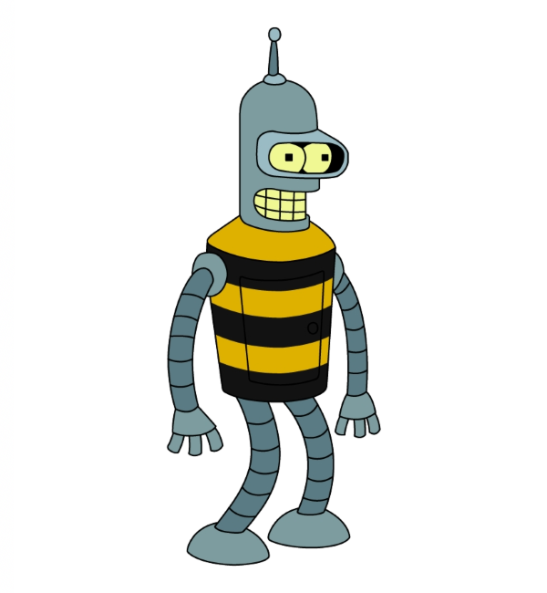

<p text align = "center">МИНИСТЕРСТВО НАУКИ  И ВЫСШЕГО ОБРАЗОВАНИЯ РОССИЙСКОЙ ФЕДЕРАЦИИ  
Федеральное государственное автономное образовательное учреждение высшего образования  

<p text align = "center">КРЫМСКИЙ ФЕДЕРАЛЬНЫЙ УНИВЕРСИТЕТ им. В. И. ВЕРНАДСКОГО"  

<p text align = "center">ФИЗИКО-ТЕХНИЧЕСКИЙ ИНСТИТУТ  

<p text align = "center">Кафедра компьютерной инженерии и моделирования
</p><br/><br/>
​

<p text align = "center"> 
<b>Отчёт по лабораторной работе № 3<br/> по дисциплине "Программирование"</b>

<br/>
​
студента 1 курса группы ИВТ 192(2)  

Давкуш Максим Константинович  
направления подготовки 09.03.01 "Информатика и вычислительная техника"  
<br/>
​
<table>

<tr><td>Научный руководитель<br/> старший преподаватель кафедры<br/> компьютерной инженерии и моделирования</td>
<td>(оценка)</td>
<td>Чабанов В.В.</td>
</tr>
</table>
<br/><br/>
​
<p text align = "center">Симферополь, 2020<br><br>
<hr>

<h2>Лабораторная работа №3 Дешифровка текста из изображения</h2><br>

<h3>Цель:</h3>

1. Закрепить навыки разработки программ использующих операторы цикла;
2. Закрепить навыки разработки программ использующих массивы;
3. Освоить методы подключения сторонних библиотек.

<p text align = "center"><b>Ход работы<br></b><br>

Изучение библиотеки для работы с изображением.<br>
1. Ознакомление с побитовыми операторами
2. Разбор алгоритмов кодировки сообщения в картинку.
3. Написание кода декодировки.<br>
Итак, перейдем к выполнению заданий.

1.Изучил библиотеку для работы с изображением, разобрался с алгоритмами кодировки.<br>
2. Мой исходный ключ для изображения: 00r 00g 00b 01r 01g 01b 10r 10g<br>
3. Результатом изученного материала является код, благодаря которому можно декодировать сообщение из изображения:<br>

```html
#include <iostream>
#include "libbmp.h"
#include <bitset>
#include <vector>
#include <fstream>

using namespace std;

int8_t color(int& x, int& y, BmpImg& Img) {
	static int8_t count = 1;
	if (count == 1) {
		count = 2;
		return Img.red_at(x, y);
	}
	else if (count == 2) {
		count = 3;
		return Img.green_at(x, y);
	}
	count = 1;
	return Img.blue_at(x, y);
};


int main() {

	ofstream disc;
	string mess;
	BmpImg Img;
	int8_t bit = 0;
	uint8_t message = 0;


	if (Img.read("pic3.bmp") != BmpError::BMP_OK) return EXIT_FAILURE;
	for ( int x = 0; x < 600; x++) {
		for ( int y = 0; y < 650; y++) {
			for (int RGB = 0; RGB < 3; RGB++) {
				message = (message << 1) | (color(x, y, Img) & 1); bit++;
				if (bit == 8) {
					if ( (message & 255) == '\0' ) {
						disc.open("messege.txt");
						disc << mess;
						disc.close();
						return EXIT_SUCCESS;
					}
					cout << mess << endl;
					mess = mess + static_cast<char>(message);
					bit = 0;
					message = 0;
				}
			}
		}

	}
	return EXIT_SUCCESS;

}
```
Изображение из которого доставался текст:<br>
<br> Рис. 1 - Пчела-бендер<br>

Результат работы кода:<br>

```html
Thomas Jefferson (April 13, 1743[a] – July 4, 1826) was an American statesman, diplomat, lawyer, architect, philosopher, and Founding Father who served as the third president of the United States from 1801 to 1809. Previously, he had served as the second vice president of the United States from 1797 to 1801. The principal author of the Declaration of Independence, Jefferson was a proponent of democracy, republicanism, and individual rights, motivating American colonists to break from the Kingdom of Great Britain and form a new nation; he produced formative documents and decisions at both the state and national level.
During the American Revolution, he represented Virginia in the Continental Congress that adopted the Declaration, drafted the law for religious freedom as a Virginia legislator, and served as the second Governor of Virginia from 1779 to 1781, during the American Revolutionary War. He became the United States Minister to France in May 1785, and subsequently the nation's first secretary of state under President George Washington from 1790 to 1793. Jefferson and James Madison organized the Democratic-Republican Party to oppose the Federalist Party during the formation of the First Party System. With Madison, he anonymously wrote the controversial Kentucky and Virginia Resolutions in 1798 and 1799, which sought to strengthen states' rights by nullifying the federal Alien and Sedition Acts.
As president, Jefferson pursued the nation's shipping and trade interests against Barbary pirates and aggressive British trade policies. He also organized the Louisiana Purchase, almost doubling the country's territory. As a result of peace negotiations with France, his administration reduced military forces. He was reelected in 1804. Jefferson's second term was beset with difficulties at home, including the trial of former vice president Aaron Burr. American foreign trade was diminished when Jefferson implemented the Embargo Act of 1807, responding to British threats to U.S. shipping. In 1803, Jefferson began a controversial process of Indian tribe removal to the newly organized Louisiana Territory, and he signed the Act Prohibiting Importation of Slaves in 1807. After retiring from public office, Jefferson founded the University of Virginia.
Jefferson, while primarily a planter, lawyer and politician, mastered many disciplines, which ranged from surveying and mathematics to horticulture and mechanics. He was an architect in the classical tradition. Jefferson's keen interest in religion and philosophy led to his presidency of the American Philosophical Society; he shunned organized religion but was influenced by both Christianity and deism. A philologist, Jefferson knew several languages. He was a prolific letter writer and corresponded with many prominent people. His only full-length book is Notes on the State of Virginia (1785), considered perhaps the most important American book published before 1800.[1]
Although regarded as a leading spokesman for democracy and republicanism in the era of the Enlightenment, some modern scholarship has been critical of Jefferson's private life, finding a contradiction between his ownership of the large numbers of slaves that worked his plantations and his famous declaration that "all men are created equal". Although the matter remains a subject of debate, most historians believe that Jefferson had a sexual relationship with his slave Sally Hemings, a mixed-race woman who was a half-sister to his late wife, and that he fathered at least one of her children. Presidential scholars and historians generally praise Jefferson's public achievements, including his advocacy of religious freedom and tolerance in Virginia. Jefferson continues to rank highly among U.S. presidents.
```

Вывод: Таким образом все цели и задачи лабораторной работы были выполнены в полном объеме. Были получены навыки работы с побитовыми операторами. Были изучены алгоритмы кодировки и декодировки сообщения из изображения. А также закрепляются знания в работе с markdown , C++.
