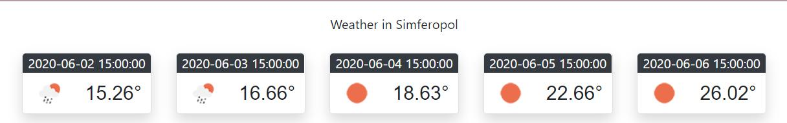

<p text align = "center">МИНИСТЕРСТВО НАУКИ  И ВЫСШЕГО ОБРАЗОВАНИЯ РОССИЙСКОЙ ФЕДЕРАЦИИ  
Федеральное государственное автономное образовательное учреждение высшего образования  

<p text align = "center">КРЫМСКИЙ ФЕДЕРАЛЬНЫЙ УНИВЕРСИТЕТ им. В. И. ВЕРНАДСКОГО"  

<p text align = "center">ФИЗИКО-ТЕХНИЧЕСКИЙ ИНСТИТУТ  

<p text align = "center">Кафедра компьютерной инженерии и моделирования
</p><br/><br/>
​

<p text align = "center"> 
<b>Отчёт по лабораторной работе № 6<br/> по дисциплине "Программирование"</b>

<br/>
​
студента 1 курса группы ИВТ-б-о-192(2)  

Давкуш Максим Константинович  
направления подготовки 09.03.01 "Информатика и вычислительная техника"  
<br/>
​
<table>

<tr><td>Научный руководитель<br/> старший преподаватель кафедры<br/> компьютерной инженерии и моделирования</td>
<td>(оценка)</td>
<td>Чабанов В.В.</td>
</tr>
</table>
<br/><br/>
​
<p text align = "center">Симферополь, 2020<br><br>
<hr>
<h2>Лабораторная работа №6 Погодный информер</h2>
<br>

Цель:

1. Закрепить навыки разработки многофайловыx приложений;
2. Изучить способы работы с API web-сервиса;
3. Изучить процесс сериализации/десериализации данных.

<h3><p text align = "center">Ход работы</p></h3>
<br>
1 API ключ от openweathermap.org<br>

```html
20a11a6b18615c90e225accf9a7de386
```

2 Полный код программы
```c++
#include <iostream>
#include <httplib/httplib.h>
#include <nlohmann/json.hpp>

using namespace httplib;
using namespace std;

using json = nlohmann::json;

void replace(std::string& str, const std::string& from, const std::string& to){
    size_t start_pos = str.find(from);
    str.replace(start_pos, from.length(), to);
}

// В этой функции формируем ответ сервера на запрос
void gen_response(const Request& req, Response& res) {
    string s;
    Client cli("api.openweathermap.org", 80);
    
    auto result = cli.Get("/data/2.5/forecast?id=693805&APPID=20a11a6b18615c90e225accf9a7de386&units=metric");
    json j = json::parse(result->body);
    cout << j.at("city").at("name") << endl;
    int start = j.at("list")[0].at("dt");

    ifstream ifs("Wither.html");
    getline(ifs, s, '\0');
    ifs.close();
    replace(s, "{city.name}", j.at("city").at("name"));
    for (auto& el : j.at("list").items())
    {
        if (el.value().at("dt") >= start)
        {
            replace(s, "{list.dt}", el.value().at("dt_txt"));
            replace(s, "{list.weather.icon}", el.value().at("weather")[0].at("icon"));
            replace(s, "{list.main.temp}", to_string(el.value().at("main").at("temp")));
            start += 86400;
        }
    }
    res.set_content(s, "text/html"); 
}

int main() {
    Server svr;                    // Создаём сервер (пока-что не запущен)
    svr.Get("/", gen_response);    // Вызвать функцию gen_response если кто-то обратиться к корню "сайта"
    svr.listen("localhost", 3000); // Запускаем сервер на localhost и порту 1234
}
//API key
//  20a11a6b18615c90e225accf9a7de386
```

3 Скриншот экрана с демонстрацией работы программы

</img>Рис. 1 - Итоговый результат

Вывод: Таким образом все цели и задачи лабораторной работы были выполнены в полном объеме. Были получены навыки  разработки многофайловыx приложений. Изучил способы работы с API web-сервиса. Изучить процесс сериализации/десериализации данных. А также закрепляются знания в работе с markdown , C++.