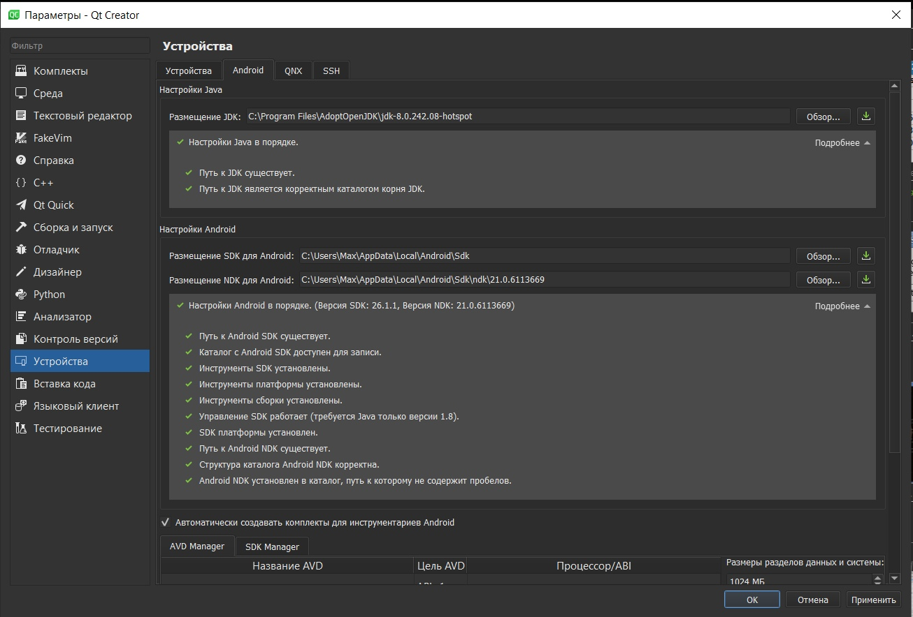
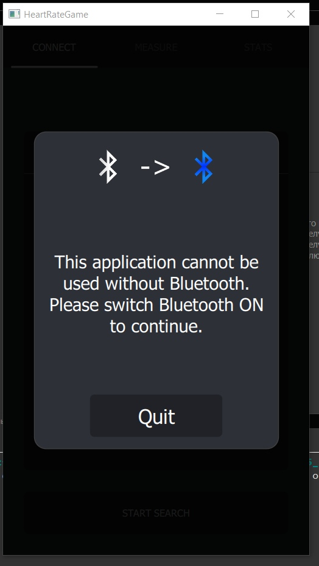

МИНИСТЕРСТВО НАУКИ  И ВЫСШЕГО ОБРАЗОВАНИЯ РОССИЙСКОЙ ФЕДЕРАЦИИ  
Федеральное государственное автономное образовательное учреждение высшего образования  

КРЫМСКИЙ ФЕДЕРАЛЬНЫЙ УНИВЕРСИТЕТ им. В. И. ВЕРНАДСКОГО"  

ФИЗИКО-ТЕХНИЧЕСКИЙ ИНСТИТУТ  

Кафедра компьютерной инженерии и моделирования

  
​

 
<b>Отчёт по лабораторной работе № 7  по дисциплине "Программирование"</b>

 
​
студента 1 курса группы ИВТ 192(2)  

Давкуш Максим Константинович  
направления подготовки 09.03.01 "Информатика и вычислительная техника"  
 
​
<table>

<tr><td>Научный руководитель  старший преподаватель кафедры  компьютерной инженерии и моделирования</td>
<td>(оценка)</td>
<td>Чабанов В.В.</td>
</tr>
</table>
  
​

Симферополь, 2020  

Цель:

  Настроить IDE Qt Creator для разработки приложений под android ОС; 
  Изучить базовые понятия связанные с мобильной разработкой; 
  Научиться создавать мобильные приложения при помощи фреймворка Qt 5.14. 

  1. Скриншот окна настроек Qt Creator после настройки для сборки android приложений:
    Рис. 1 - Окно настроек Qt Creator после настройки для сборки android приложений  

  2. Проект - <b>Bluetooth Low Energy Heart Rate Game</b>

  
 Рис. 2 - Heart Rate Game 

  3. Скриншот экрана с запущенным приложением на устройстве: 

  
  Рис. 3 - Скриншот с мобильного телефона 

  Вывод: в данной лабораторной работе были получены навыки настройки Qt Creator для работы с Android. А также получили базовые понятия связанные с мобильной разработкой, научились создавать мобильные приложения при помощи фреймворка Qt 5.14