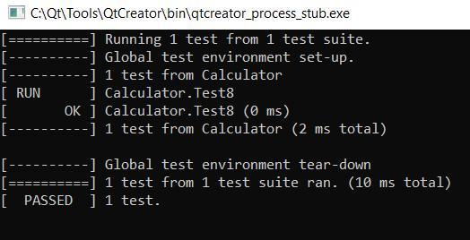

<p text align = "center">МИНИСТЕРСТВО НАУКИ  И ВЫСШЕГО ОБРАЗОВАНИЯ РОССИЙСКОЙ ФЕДЕРАЦИИ  
Федеральное государственное автономное образовательное учреждение высшего образования  

<p text align = "center">КРЫМСКИЙ ФЕДЕРАЛЬНЫЙ УНИВЕРСИТЕТ им. В. И. ВЕРНАДСКОГО"  

<p text align = "center">ФИЗИКО-ТЕХНИЧЕСКИЙ ИНСТИТУТ  

<p text align = "center">Кафедра компьютерной инженерии и моделирования
</p><br/><br/>
​

<p text align = "center"> 
<b>Отчёт по лабораторной работе № 9<br/> по дисциплине "Программирование"</b>

<br/>
​
студента 1 курса группы ИВТ-б-о-192(2)  

Давкуш Максим Константинович  
направления подготовки 09.03.01 "Информатика и вычислительная техника"  
<br/>
​
<table>

<tr><td>Научный руководитель<br/> старший преподаватель кафедры<br/> компьютерной инженерии и моделирования</td>
<td>(оценка)</td>
<td>Чабанов В.В.</td>
</tr>
</table>
<br/><br/>
​
<p text align = "center">Симферополь, 2020<br><br>
<hr>

<h2>Лабораторная работа №9 Тестирование при помощи Google Test Framework</h2>

<b>Цель:</b>

1. Познакомиться с Google Test и Google Mock Framework;
2. Изучить базовые понятия относящийся к тестированию кода;
3. Научиться тестировать классы в среде разработки Qt Creator.

<p text align = "center"><b>Ход работы</b></p>
<br>

<h3><p text align = "center"><b>Тест 1</h3></b></p>
<br>
Для проверки вызова метода wait() используем макросы:

1. EXPECT_CALL - проверка вызова метода;
2. Times - количество вызвовов;
3. Exactly - точное совпадение полученого количества вызовов с ожидаемым.

```с++
TEST(Calculator, Test1)
{
    MockIKeypad keypad;
    EXPECT_CALL(keypad, wait()).Times(Exactly(1));
    MockILatch latch;
    LockController door (&keypad, &latch);
    door.wait();
}
```
<br>
<p text align = "center"></img><br>Рис. 1 - Код 1-го теста</p>
<br>
<h3><p text align = "center"><b>Тест 2</h3></b></p>
<br>

Для проверки вызова метода getDoorStatus() используем макросы:

1. EXPECT_CALL - проверка вызова метода;
2. Times - количество вызвовов;
3. Exactly - точное совпадение полученого количества вызовов с ожидаемым.<br><br>

Для проверки возвращаемого значения метода isDoorOpen() используем макросы:

1. ASSERT_FALSE - равен ли аргумент false;
2. WillRepeatedly - возвращает значение при каждом вызове;
3. Return - возвращаемое значение.

Дверь закрыта. Значит класс ILatch должен вернуть DoorStatus::CLOSE при вызове метода getDoorStatus<br>

```c++
TEST(Calculator, Test2)
{
    MockIKeypad keypad;
    MockILatch latch;
    LockController door (&keypad, &latch);
    EXPECT_CALL(latch, getDoorStatus()).Times(Exactly(1)).WillRepeatedly(Return(DoorStatus::CLOSE));
    ASSERT_FALSE(door.isDoorOpen());
}
```
<br>
<p text align = "center"></img><br>Рис. 2 - Код 2-го теста</p>
<br>
<h3><p text align = "center"><b>Тест 3</h3></b></p>
<br>
Для проверки вызова метода getDoorStatus() используем макросы:

1. EXPECT_CALL - проверка вызова метода;
2. Times - количество вызвовов;
3. Exactly - точное совпадение полученого количества вызовов с ожидаемым.

Для проверки возвращаемого значения метода isDoorOpen() используем макросы:

1. ASSERT_TRUE - равен ли аргумент true;
2. WillRepeatedly - возвращает значение при каждом вызове;
3. Return - возвращаемое значение.

Дверь открыта. Значит класс ILatch должен вернуть DoorStatus::OPEN при вызове метода getDoorStatus.
<br>
```c++
TEST(Calculator, Test3)
{
    MockIKeypad keypad;
    MockILatch latch;
    LockController door (&keypad, &latch);
    EXPECT_CALL(latch, getDoorStatus()).Times(Exactly(1)).WillRepeatedly(Return(DoorStatus::OPEN));
    ASSERT_TRUE(door.isDoorOpen());
}
```
<p text align = "center"></img><br>Рис. 3 - Код 3-го теста</p>
<br>
<h3><p text align = "center"><b>Тест 4</h3></b></p>
<br>
Для проверки вызова метода open() используем макросы:

1. EXPECT_CALL - проверка вызова метода;
2. Times - количество вызвовов;
3. Exactly - точное совпадение полученого количества вызовов с ожидаемым.

Для проверки возвращаемого значения метода unlockDoor() используем макросы:

1. ASSERT_EQ - равны ли аргументы;
2. WillRepeatedly - возвращает значение при каждом вызове;
3. Return - возвращаемое значение.

Защелка двери успешно открывается. Значит класс ILatch должен вернуть DoorStatus::OPEN при вызове метода open.
```c++
TEST(Calculator, Test4)
{
    MockIKeypad keypad;
    MockILatch latch;
    LockController door (&keypad, &latch);
    EXPECT_CALL(latch, open()).Times(Exactly(1)).WillRepeatedly(Return(DoorStatus::OPEN));
    ASSERT_EQ(door.unlockDoor(), DoorStatus::OPEN);
}
```
<br>
<p text align = "center"></img><br>Рис. 4 - Код 4-го теста</p>
<br>
<h3><p text align = "center"><b>Тест 5</h3></b></p>
<br>
Для проверки вызова метода close() используем макросы:

1. EXPECT_CALL - проверка вызова метода;
2. Times - количество вызвовов;
3. Exactly - точное совпадение полученого количества вызовов с ожидаемым.

Для проверки возвращаемого значения метода lockDoor() используем макросы:

1. ASSERT_EQ - равны ли аргументы;
2. WillRepeatedly - возвращает значение при каждом вызове;
3. Return - возвращаемое значение.

Защелка двери успешно закрывается. Значит класс ILatch должен вернуть DoorStatus::CLOSE при вызове метода open.

```c++
TEST(Calculator, Test5)
{
    MockIKeypad keypad;
    MockILatch latch;
    LockController door (&keypad, &latch);
    EXPECT_CALL(latch, close()).Times(Exactly(1)).WillRepeatedly(Return(DoorStatus::CLOSE));
    ASSERT_EQ(door.lockDoor(), DoorStatus::CLOSE);
}
```
<br>
<p text align = "center"></img><br>Рис. 5 - Код 5-го теста</p>
<br>
Из Рис. 5 видно, что метод lockDoor не вернул ожидаемое DoorStatus::CLOSE потому что метод close не был вызван. Рассмотрим программный код метода lockDoor. Видно, что в теле метода вызовается метод open класса ILatch. Иными словами, мы открываем дверь, когда от нас ожидают ее закрытия. Исправить ошибку можно заменой вызова метода open на вызов метода close.

Код с ошибкой<br>
```c++
DoorStatus LockController::lockDoor()
{
    return latch->open();
}
```
<br>
Исправленный код<br>

```c++
DoorStatus LockController::lockDoor()
{
    return latch->close();
}
```

Данная ошибка может возникать в результате копирования тел схожих методов.

<h3><p text align = "center"><b>Тест 6</h3></b></p>
<br>
Для проверки вызова метода isActive() используем макросы:

1. EXPECT_CALL - проверка вызова метода;
2. Times - количество вызвовов;
3. Exactly - точное совпадение полученого количества вызовов с ожидаемым.

Для проверки возвращаемого значения метода hardWareCheck() используем макросы:

1. ASSERT_EQ - равны ли аргументы;
2. WillRepeatedly - возвращает значение при каждом вызове;
3. Return - возвращаемое значение.

С оборудллванем все в порядке. Значит методы isActive классов IKeypad и ILatch должны вернуть true.

```c++
TEST(Calculator, Test6)
{
    MockIKeypad keypad;
    MockILatch latch;
    LockController door (&keypad, &latch);
    EXPECT_CALL(keypad, isActive()).Times(Exactly(1)).WillRepeatedly(Return(true));
    EXPECT_CALL(latch, isActive()).Times(Exactly(1)).WillRepeatedly(Return(true));
    ASSERT_EQ(door.hardWareCheck(), HardWareStatus::OK);
}
```
<br>
<p text align = "center"></img><br>Рис. 6 - Код 6-го теста</p>
<br>
<h3><p text align = "center"><b>Тест 7</h3></b></p>
<br>
Для проверки вызова метода isActive() используем макросы:

1. EXPECT_CALL - проверка вызова метода;
2. Times - количество вызвовов;
3. AnyNumber - любое число вызовов.

Для проверки возвращаемого значения метода hardWareCheck() используем макросы:

1. ASSERT_EQ - равны ли аргументы;
2. WillRepeatedly - возвращает значение при каждом вызове;
3. Return - возвращаемое значение.

С задвижкой все в порядке. Значит метод isActive класса ILatch должен вернуть true.
```c++
TEST(Calculator, Test7)
{
    MockILatch latch;
    MockIKeypad keypad;
    LockController door (nullptr, &latch);
    EXPECT_CALL(keypad, isActive()).Times(AnyNumber());
    EXPECT_CALL(latch, isActive()).Times(AnyNumber()).WillRepeatedly(Return(true));
    ASSERT_EQ(door.hardWareCheck(), HardWareStatus::ERROR);
}
```
<br>

<p text align = "center"></img><br>Рис. 7 - Код 7-го теста</p>
<br>
<h3><p text align = "center"><b>Тест 8</h3></b></p>
<br>
Для проверки вызова метода isActive() используем макросы:

1. EXPECT_CALL - проверка вызова метода;
2. Times - количество вызвовов;
3. AnyNumber - любое число вызовов.

Для проверки возвращаемого значения метода hardWareCheck() используем макросы:

1. ASSERT_EQ - равны ли аргументы;
2. WillRepeatedly - возвращает значение при каждом вызове;
3. Return - возвращаемое значение.

Задвижка не активна. Значит метод isActive класса ILatch должен вернуть false. С клавиатурой все в порядке. Значит метод isActive класса IKeypad должен вернуть true.
```c++
TEST(Calculator, Test8)
{
    MockIKeypad keypad;
    MockILatch latch;
    LockController door (&keypad, &latch);
    EXPECT_CALL(keypad, isActive()).Times(AnyNumber()).WillRepeatedly(Return(true));
    EXPECT_CALL(latch, isActive()).Times(AnyNumber()).WillRepeatedly(Return(false));
    ASSERT_EQ(door.hardWareCheck(), HardWareStatus::ERROR);
}
```
<br>
<p text align = "center"></img><br>Рис. 8 - Код 8-го теста</p>
<br>
<h3><p text align = "center"><b>Тест 9</h3></b></p>
<br>
Для проверки вызова метода requestPassword() используем макросы:

1. EXPECT_CALL - проверка вызова метода;
2. Times - количество вызвовов;
3. Exactly - точное совпадение полученого количества вызовов с ожидаемым.

Для проверки возвращаемого значения метода isCorrectPassword() используем макросы:

1. ASSERT_TRUE - равен ли аргумент true;
2. WillRepeatedly - возвращает значение при каждом вызове;
3. Return - возвращаемое значение.

Следуем тексту задания и комментариям в программном коде. После вызова конструктора поле password класса LockController имеет значение 0000. Для ввода пароля используется метод isCorrectPassword, который запрашивает пароль у класса IKeypad. Значит метод requestPassword класса IKeypad должен вернуть PasswordResponse{PasswordResponse::Status::OK, "0000"}.

```c++
TEST(Calculator, Test9)
{
    MockIKeypad keypad;
    MockILatch latch;
    LockController door (&keypad, &latch);
    EXPECT_CALL(keypad, requestPassword()).Times(Exactly(1)).WillRepeatedly(Return(PasswordResponse{PasswordResponse::Status::OK, "0000"}));
    ASSERT_TRUE(door.isCorrectPassword());
}
```
<br>
<p text align = "center"></img><br>Рис. 9 - Код 9-го теста</p>
<br>
<h3><p text align = "center"><b>Тест 10</h3></b></p>
<br>
Для проверки вызова метода requestPassword() используем макросы:

1. EXPECT_CALL - проверка вызова метода;
2. Times - количество вызвовов;
3. Exactly - точное совпадение полученого количества вызовов с ожидаемым.

Для проверки возвращаемого значения метода isCorrectPassword() используем макросы:

1. ASSERT_FALSE - равен ли аргумент false;
2. WillRepeatedly - возвращает значение при каждом вызове;
3. Return - возвращаемое значение.

В отличии от предыдущего теста, пользователь вводит неправильный пароль. Значит метод requestPassword класса IKeypad должен вернуть неправильный пароль, например PasswordResponse{PasswordResponse::Status::OK, "1337"}.

```c++
TEST(Calculator, Test10)
{
    MockIKeypad keypad;
    MockILatch latch;
    LockController door (&keypad, &latch);
    EXPECT_CALL(keypad, requestPassword()).Times(Exactly(1)).WillRepeatedly(Return(PasswordResponse{PasswordResponse::Status::OK, "1337"}));
    ASSERT_FALSE(door.isCorrectPassword());
}
```
<br>
<p text align = "center"></img><br>Рис. 10 - Код 10-го теста</p>
<br>
<h3><p text align = "center"><b>Тест 11</h3></b></p>
<br>
Для проверки вызова метода requestPassword() используем макросы:

1. EXPECT_CALL - проверка вызова метода;
2. Times - количество вызвовов;
3. Exactly - точное совпадение полученого количества вызовов с ожидаемым.

Для проверки возвращаемого значения метода resetPassword() используем макросы:

1. ASSERT_TRUE - равен ли аргумент true;
2. WillRepeatedly - возвращает значение при каждом вызове;
3. Return - возвращаемое значение.

Для сброса пароля пользователь должен ввести старый пароль. Значит метод requestPassword класса IKeypad должен вернуть PasswordResponse{PasswordResponse::Status::OK, "0000"}. Далее пользователь вводит новый пароль, например 1337. Значит метод requestPassword класса IKeypad должен вернуть PasswordResponse{PasswordResponse::Status::OK, "1337"}. Для проверки установленного пароля вызовем метод isCorrectPassword (предыдущие тесты показали, что он работает корректно), при этом IKeypad должен вернуть PasswordResponse{PasswordResponse::Status::OK, "1337"}.

```c++
TEST(Calculator, Test11)
{
    MockIKeypad keypad;
    MockILatch latch;
    LockController door (&keypad, &latch);
    EXPECT_CALL(keypad, requestPassword()).Times(Exactly(3))
            .WillOnce(Return(PasswordResponse{PasswordResponse::Status::OK, "0000"}))
            .WillRepeatedly(Return(PasswordResponse{PasswordResponse::Status::OK, "1337"}));
    door.resetPassword();
    ASSERT_TRUE(door.isCorrectPassword());
}
```
<br>
<p text align = "center"></img><br>Рис. 11 - Код 11-го теста</p>
<br>
<h3><p text align = "center"><b>Тест 12</h3></b></p>
<br>
Для проверки вызова метода requestPassword() используем макросы:

1. EXPECT_CALL - проверка вызова метода;
2. Times - количество вызвовов;
3. Exactly - точное совпадение полученого количества вызовов с ожидаемым.

Для проверки возвращаемого значения метода resetPassword() используем макросы:

1. ASSERT_TRUE - равен ли аргумент true;
2. WillRepeatedly - возвращает значение при каждом вызове;
3. Return - возвращаемое значение.

Устанавливаем пароль 9876 вызовом метода resetPassword и вводом старого пароля 0000 и нового пароля 9876. Далее действия аналогичны предыдущему тесту.
```c++
TEST(Calculator, Test12)
{
    MockIKeypad keypad;
    MockILatch latch;
    LockController door (&keypad, &latch);
    EXPECT_CALL(keypad, requestPassword()).Times(Exactly(5))
            .WillOnce(Return(PasswordResponse{PasswordResponse::Status::OK, "0000"}))
            .WillOnce(Return(PasswordResponse{PasswordResponse::Status::OK, "9876"}))
            .WillOnce(Return(PasswordResponse{PasswordResponse::Status::OK, "9876"}))
            .WillRepeatedly(Return(PasswordResponse{PasswordResponse::Status::OK, "1337"}));
    door.resetPassword();  // меняем на 9876
    door.resetPassword();  // пользователь вводит пароль
    ASSERT_TRUE(door.isCorrectPassword());  // сравниваемся
}
```
<br>
<p text align = "center"></img><br>Рис. 12 - Код 12-го теста</p>

Результат запуска всех тестов:<br>
<p text align = "center"></img><br>Рис. 13 - результат запуска 12 тестов</p>
<br>
Вывод: Таким образом все цели и задачи лабораторной работы были выполнены в полном объеме. Познакомился с Google Test и Google Mock Framework. Изучил базовые понятия относящийся к тестированию кода. Научился тестировать классы в среде разработки Qt Creator. А также закрепляются знания в работе с markdown , C++.